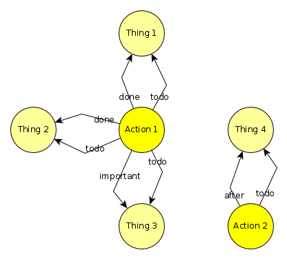

# JJGraphDatabase
Estudos em Graph Database

# Objetivos
Estudos de uma estrutura de banco de dados em grafo (nodes e edges) implementada em SQL puro.

A idéia é trazer esse mundo de banco de dados em grafo para o SQL. Pretendo implementar em SQLite, MySQL e PostgreSQL.

Aa grandes vantagens que encontrei foram:
  * diversão! 8)
  * schemaless!
  * ter um modelo unificado para trabalhar com os dados, são nove tabelas principais, chegando a treze no total, para os relacionamentos no sql
  * permitir uma modelagem muito rápida e eficiente
  * abstração do modelo muito mais próxima à realidade
  
 
 
 
 # Exemplos
  A modelagem é bem diferente da tradicional, mas é muito mais rica. Abaixo um TODO. Nele coloquei duas coisas além do "todo" e "done", que são "after" e "important". O modelo vai evoluindo de forma muito simples. 
 
 
 
 
 # Contatos
 Cesar Marinho 
 cesarmarinhorj@gmail.com
 cesar@creaturae.net
 
